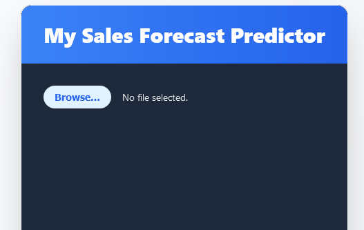
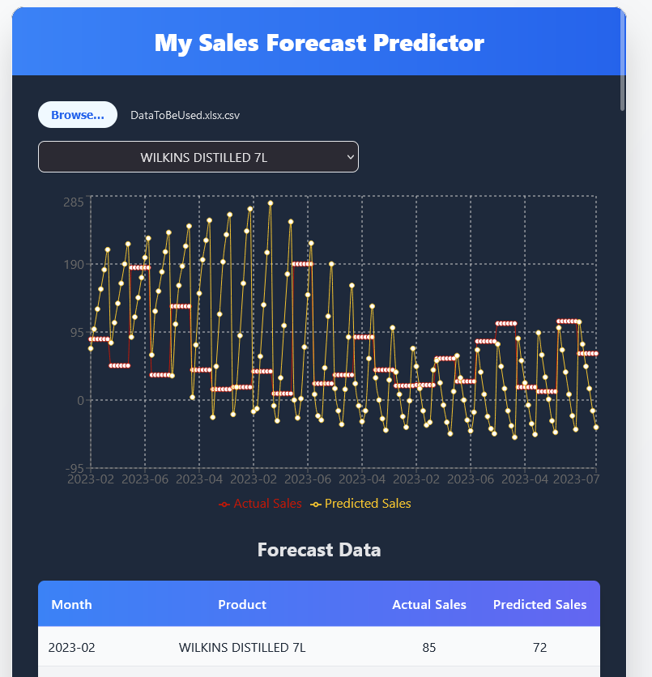

# Sales Forecasting Predictor using TensorFlow in ReactJs

Needed to rework:
[1] Other page rendered for forecasted table.
[2] improve data training as a research an optimized way of doing it.
[3] No dropdown selection for All Products since i still studying how to do it.

Needed dependencies
 all not included in gitignore just do:

    - npm install 

Importing Csv File:
   
    - used the csv named DataToBeUsed in the project file

- This one is for my activity in one of my 3rd year subject which is Application Development. We instructed to create an application that predicts sales ranging in future 6 months. We also allowed to use machine learning dependencies such as TensorFlow, Recharts as a charting tool and PaPaparse for parsing file type data. 

Sample illustration of application

    - Uploading Interface
        

    - Main Interface along with Table
        

This template provides a minimal setup to get React working in Vite with HMR and some ESLint rules.

Currently, two official plugins are available:

- [@vitejs/plugin-react](https://github.com/vitejs/vite-plugin-react/blob/main/packages/plugin-react/README.md) uses [Babel](https://babeljs.io/) for Fast Refresh
- [@vitejs/plugin-react-swc](https://github.com/vitejs/vite-plugin-react-swc) uses [SWC](https://swc.rs/) for Fast Refresh
